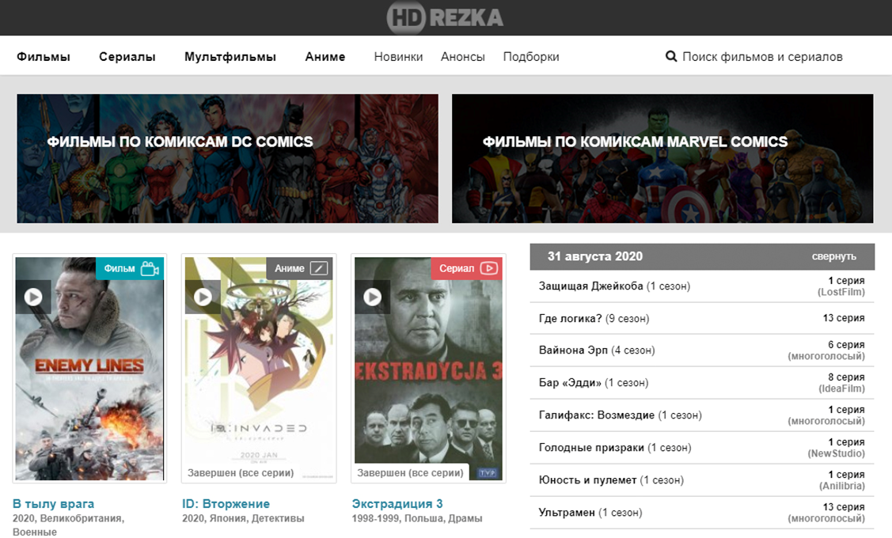

#HD REZKA web-site

****

In the presentation of current practice lesson you have example of some web-page.
It is the main page of **HD REZKA** web-site. During the lesson you must develop the same web page.
The focus of reviewer will be on using **Sass** preprocessing and **Gulp** project builder.

All files of result project must be added as *pull request* to
[GitHub](https://github.com/Group282/pz-1-8).

User side of page should look like this:
